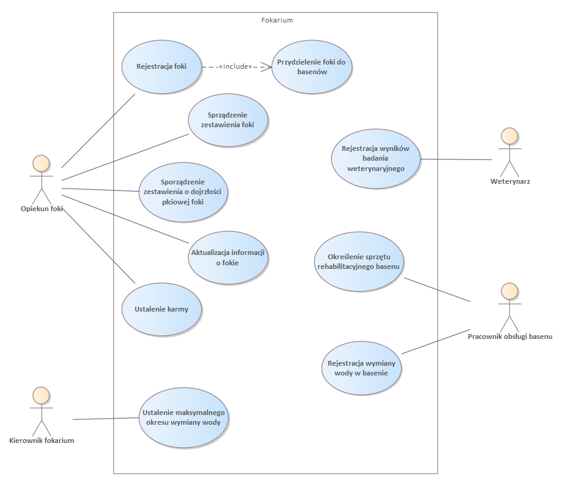

# Fokarium

System „Fokarium” został zaprojektowany w celu ułatwienia zarządzania fokarium oraz prowadzenia ewidencji fok przebywających zarówno w basenach fokarium, jak i żyjących na wolności. System wspiera opiekunów fok w codziennej pracy, umożliwiając efektywne śledzenie informacji o fokach, basenach, karmieniu, badaniach weterynaryjnych oraz wymianach wody. Ten projekt przedstawia diagram przypadków użycia, model domeny, diagram sekwencji, diagram sekwencji systemu, diagram współpracy. 
System został zaprojektowany z uwzględnieniem wymagań opisanych w pliku `Wypozyczalnia_Kaset_wymagania.pdf`

## Diagramy

1. Diagram przypadków użycia
Przedstawia główne funkcjonalności systemu i interakcje użytkowników (opiekun foki, kierownik fokarium, weterynarz, pracownik obsługi basenu) z systemem.

2. Model domeny
Definiuje podstawowe elementy systemu i relacje między nimi, takie jak:

Klasy: Pracownik fokarium (Opiekun oraz Kierownik fokarium), Foka (urodzona w fokarium oraz urodzona na wolności), Basen (podział na pobytowe i rehabilitacyjne), Stanowisko obserwacyjne, Karma, Badanie weterynaryjne.
Relacje: np. „Foka przebywa w basenie”, „Opiekun rejestruje fokę” itd.

3. Diagram sekwencji
Opisuje proces przyjęcia nowej foki.

4. Diagram sekwencji systemu
Przedstawia interakcje między systemem a opiekunem podczas dodania nowej foki.

5. Diagram współpracy
Przedstawia współdziałanie elementów systemu w trakcie przyjęcia nowej foki.

## Pliki projektu

- **Diagram przypadków użycia EA**: `Diagram_pzypadków_użycia-Fokarium.que`
- **Diagram przypadków użycia PNG**: `Diagram_pzypadków_użycia-Fokarium.png`
- **Model domeny EA**: `Model_domeny-Fokarium.que`
- **Model domeny PNG**: `Model_domeny-Fokarium.png`
- **Diagram sekwencji EA**: `Diagram_sekwencji-Fokarium.que`
- **Diagram sekwencji PNG**: `Diagram_sekwencji-Fokarium.png`
- **Diagram sekwencji systemu EA**: `Diagram_sekwencji_systemu-Fokarium.que`
- **Diagram sekwencji systemu PNG**: `Diagram_sekwencji_systemu-Fokarium.png`
- **Diagram współpracy EA**: `Diagram_współpracy-Fokarium.que`
- **Diagram współpracy PNG**: `Diagram_współpracy-Fokarium.png`
- **Opis wymagań**: `Fokarium-opis_wymagań.pdf`
