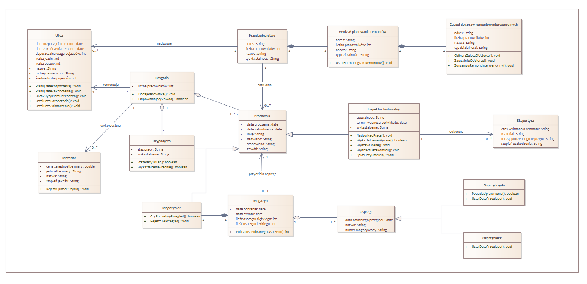

# Przedsiębiorstwo Remontowe Dróg – Diagram Klas

Ten projekt przedstawia diagram klas dla systemu informatycznego wspierającego działalność przedsiębiorstwa zajmującego się remontami dróg publicznych w mieście wojewódzkim. Diagram klas ilustruje strukturę danych oraz relacje między kluczowymi elementami systemu.
System został zaprojektowany z uwzględnieniem wymagań opisanych w pliku `Przedsiębiorstwo_remontowe-opis_wymagań.pdf`

## Diagram klas
Poniżej znajduje się wizualizacja diagramu klas obejmująca następujące klasy:

1. Przedsiębiorstwo: Działalność polega na nadzorowaniu dróg i zatrudnianiu pracowników oraz posiada wydział planowania remontów. 
2. Pracownik: Dane dotyczące pracowników fizycznych, brygadzistów i inspektorów budowlanych oraz magazyniera.
3. Brygada: Zespoły przypisane do określonych zadań remontowych, kierowane przez brygadzistę.
4. Osprzęt: Informacje o narzędziach, podziale na kategorie (lekki/ciężki) oraz przeglądach technicznych.
5. Magazyn: Miejsce przechowywania sprzętu i jego pobierania przez pracowników.
6. Magazynier: Zgłasza konieczność dokonania przeglądu.  
6. Ulica: Dane o zarządzanych ulicach objętych nadzorem przedsiębiorstwa.
7. Materiał: Dane dotyczące zużytych materiałów.
8. Wydział planowania remontów: Tworzenie harmonogramów i reagowanie na zgłoszenia.
9. Ekspertyza: Dokumenty przygotowywane przez inspektorów przed rozpoczęciem remontu.
10. Wydział planowania remontów: Tworzenie harmonogramów i w jego skład wchodzi zespół do spraw remontów interwencyjnych.
11. Zespół do spraw remontów interwencyjnych: Zbieranie zgłodzenia o usterce i zapisaniu informacji o niej w systemie, zorganizowanie remontu interwencyjnego.

## Pliki projektu
- **Diagram Klas EA**: `Diagram_klass-Przedsiębiorstwo_Remontowe_Dróg.que`
- **Diagram Klas PNG**: `Diagram_klass-Przedsiębiorstwo_Remontowe_Dróg.png`
- **Opis wymagań**: `Przedsiębiorstwo_remontowe-opis_wymagań.pdf`