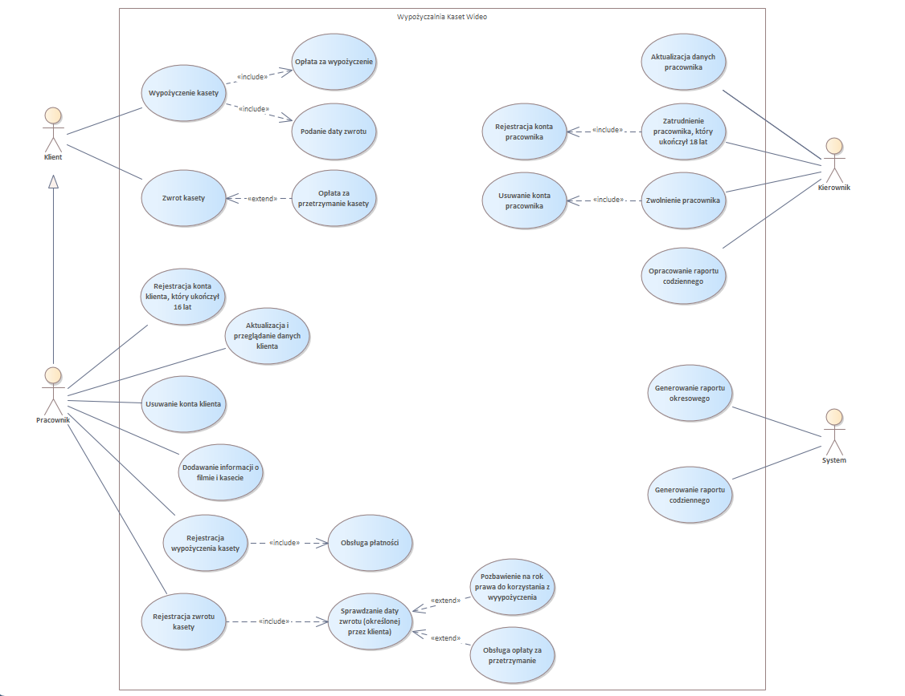

# Wypożyczalnia kaset wideo - diagram przypadków użycia

Ten projekt przedstawia diagram przypadków użycia dla systemu zarządzania wypożyczalnią kaset wideo, który ilustruje kluczowe interakcje pomiędzy użytkownikami systemu a funkcjonalnościami, które system oferuje.
System został zaprojektowany z uwzględnieniem wymagań opisanych w pliku `Wypozyczalnia_Kaset-opis_wymagań.pdf`

## Diagram przypadków użycia
Poniżej znajduje się wizualizacja diagramu przypadków użycia, która przedstawia interakcje klientów, pracowników i kierownika z systemem wypożyczalni.

## Pliki projektu
- **Diagram przypadków użycia EA**: `Diagram_pzypadków_użycia-Wypożyczalnia_Kaset_Wideo.que`
- **Diagram przypadków użycia PNG**: `Diagram_pzypadków_użycia-Wypożyczalnia_Kaset_Wideo.png`
- **Opis wymagań**: `Wypozyczalnia_Kaset-opis_wymagań.pdf`

