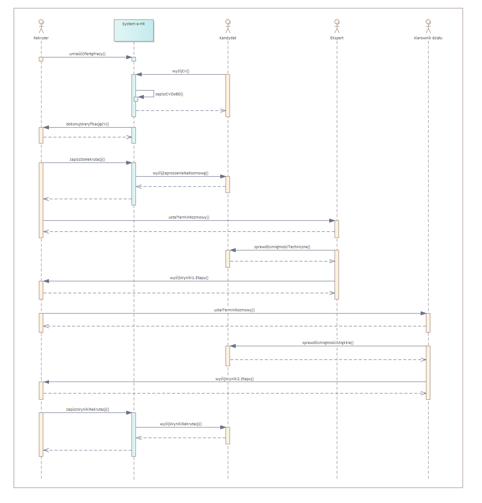
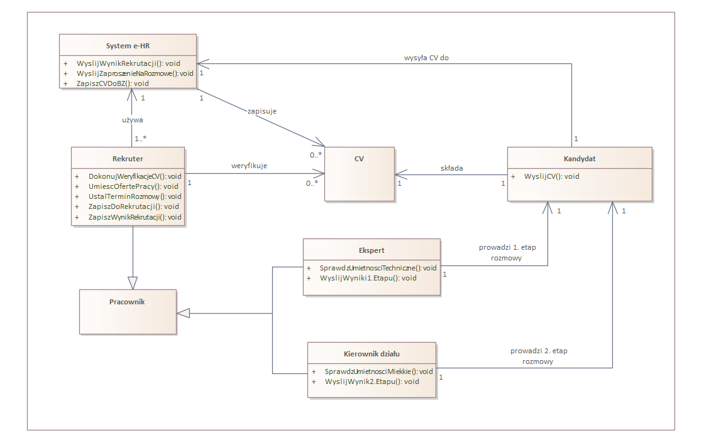

# e-HR

System e-HR został zaprojektowany w celu wspierania procesów rekrutacyjnych w firmach. Umożliwia on skuteczne zarządzanie etapami rekrutacji kandydatów na różne stanowiska, ustalanie terminów rozmów, wysyłanie powiadomień oraz monitorowanie wyników rekrutacji.

## Diagramy

1. Diagram sekwencji: 
Diagram sekwencji przedstawia interakcje między kandydatem, systemem e-HR, rekruterem, ekspertem oraz kierownikiem działu w procesie rekrutacji na wybrane stanowisko.

2. Diagram klas
Uproszczony diagram klas dla systemu e-HR definiuje kluczowe obiekty oraz relacje między nimi.

## Pliki projektu
- **Diagram sekwencji EA**: `Diagram_sekwencji-e-HR.que`
- **Diagram sekwencji PNG**: `Diagram_sekwencji-e-HR.png`
- **Diagram Klas EA**: `Diagram_klas-e-HR.que`
- **Diagram Klas PNG**: `Diagram_klas-e-HR.png`
- **Opis wymagań**: `e-HR-opis_wymagań.pdf`